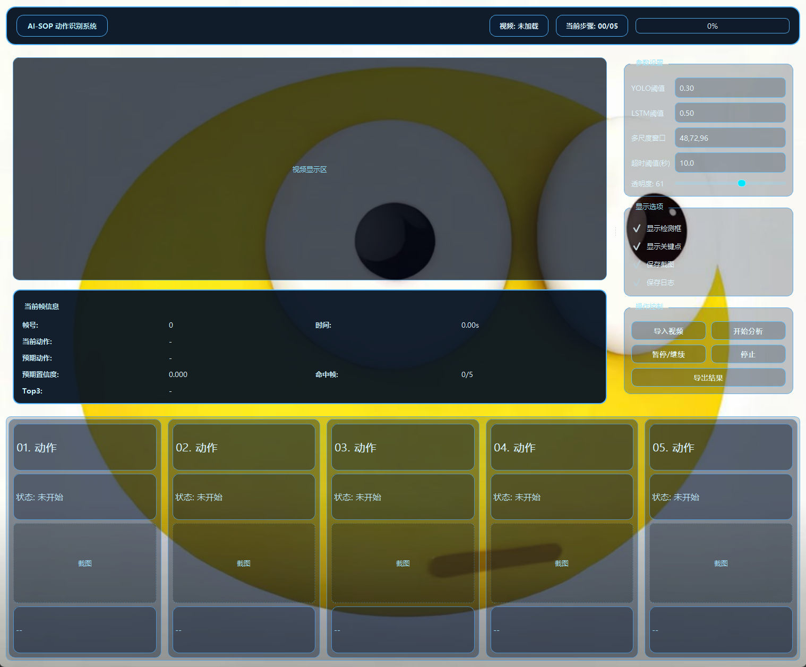

# AI-SOP 动作识别系统

> 一个面向装配场景的 SOP（Standard Operating Procedure）动作识别项目。  
> 支持从 **数据标注 → YOLO → 特征提取 → LSTM → GUI实时演示** 的完整闭环复现。

---

## 项目由来

大家好，我是夏别，一名热衷于音视频开发的技术爱好者。
最近在视频号、抖音等平台上，我经常看到一些关于 AI-SOP 工厂流水线质量检测 的方案展示：通过摄像头对准工位，自动判断某个螺丝是否漏打、某道工序是否遗漏，以及装配质量是否达标。
我出于好奇去咨询过相关方案，发现商业化价格并不低。
因为自己有音视频开发基础，我就想亲自弄明白：这类系统到底是怎么实现的？
然而在各大开源网站检索后，我并没有找到一个真正可用于学习、可完整复现的案例，这反而更激发了我的兴趣。
于是，我开始系统查资料、做实验、踩坑迭代，最终搭建了这一套从数据标注、模型训练到图形化演示的 AI-SOP 解决方案。
我把它开源出来，是希望尽力补上这一方向在中文开源社区中的实践空白——把技术“拆开讲清楚”，让更多开发者能看得懂、跑得通、复现得了。
也希望借助互联网的分享精神，把我所学所会尽可能公开透明地展示出来，为国内开源生态贡献一个可参考、可扩展的真实项目样例。

---

## 1. 项目定位（你可以在视频开头这样讲）

这个系统解决的是：

- 在装配视频中自动识别“当前正在执行的步骤”
- 判断是否按既定 SOP 顺序执行
- 在 GUI 中实时展示：当前动作、预期动作、Top3 候选、命中帧、步骤进度
- 在每个动作完成后自动截图留档，支持导出日志

适用场景：

- 毕设/课程项目展示
- 工业 SOP 质检原型验证
- 小样本动作识别系统搭建实践

---

## 2. 系统效果图



---

## 3. 技术栈（讲解重点）

### 3.1 模型与算法层

- **YOLOv8（Ultralytics）**
  - 作用：检测装配关键物体（`base/frame/mirror/screw`）
  - 输出：每帧目标的类别、置信度、边框

- **MediaPipe Hands**
  - 作用：提取手部关键点（最多2只手，每只21个关键点）
  - 输出：手关键点三维坐标（x, y, z）

- **LSTM（PyTorch）**
  - 作用：基于时序特征识别动作步骤（S1~S5）
  - 输入：YOLO检测特征 + 手关键点特征
  - 输出：动作类别概率、Top3候选、最终动作判定

- **多尺度时序窗口融合**
  - 默认：`48,72,96`
  - 作用：兼顾短时响应和长时稳定性，减少抖动误判

---

### 3.2 工程与界面层

- **PyQt5**：桌面 GUI 可视化
- **OpenCV**：视频读取、帧处理、绘制
- **NumPy / Pandas**：特征与标注数据处理
- **Pillow**：中文绘制与图像处理

---

### 3.3 运行环境版本（当前项目）

请以 `requirements.txt` 为准，核心版本：

- `ultralytics==8.3.63`
- `torch==2.2.2`
- `torchvision==0.17.2`
- `mediapipe==0.10.9`
- `opencv-python==4.13.0.90`
- `numpy==1.26.4`
- `pandas==2.3.3`
- `Pillow==10.2.0`
- `PyQt5==5.15.10`

---

## 4. 总体架构（建议你在视频里画流程）

```text
视频输入
  └─> YOLO检测（部件目标）
  └─> MediaPipe手关键点（手部时序）
      └─> 帧级融合特征
          └─> 多尺度窗口重采样
              └─> LSTM动作识别
                  └─> 顺序约束 + 命中帧确认
                      └─> GUI显示 + 截图 + 日志导出
```

---

## 5. 动作定义（当前5步）

1. **S1**：安装底座与骨架连接处（`S1_base_frame_joint`）
2. **S2**：固定骨架与镜面（`S2_frame_mirror_fix`）
3. **S3**：安装右边螺丝（`S3_right_screw`）
4. **S4**：安装左边螺丝（`S4_left_screw`）
5. **S5**：安装完成检查（`S5_final_check`）

---

## 6. 目录结构（核心）

```text
.
├─ ai_sop_gui.py
├─ train_yolo_mirror.py
├─ requirements.txt
├─ full_timeline_10videos_template.csv
├─ 背景图片.jpg
├─ video/
├─ yolo/
│  ├─ train/images + labels
│  ├─ val/images + labels
│  ├─ test/images + labels
│  └─ data.yaml
├─ runs_detect/                      # YOLO训练输出
└─ lstm_runs_fine/                   # 时序模型推理权重与配置
```

---

## 7. 从零复现步骤（可直接照着录视频）

### Step 0：安装依赖

```bash
pip install -r requirements.txt
```

---

### Step 0：启动 GUI 演示

```bash
python ai_sop_gui.py
```

GUI中可看到：

- 当前动作
- 预期动作
- 预期置信度
- 命中帧
- Top3
- 步骤卡片状态（未开始/进行中/完成）

---

## 8. GUI 参数说明（讲解建议）

- **YOLO阈值**：检测最小置信度
  - 高：更严格，漏检可能增加
  - 低：更敏感，误检可能增加

- **LSTM阈值**：动作确认置信阈值
  - 高：步骤更难通过，但更稳
  - 低：步骤更易通过，但可能误触发

- **多尺度窗口**（例如 `48,72,96`）
  - 窗口短：响应快，易抖
  - 窗口长：更稳，响应慢
  - 多尺度融合：折中效果最好

- **透明度**：界面视觉参数，不影响算法结果

---

## 9. 关键机制说明（可作为“技术亮点”）

### 9.1 多尺度投票
同一时刻在多个窗口长度上分别预测，再做融合，降低偶发抖动。

### 9.2 顺序约束
系统按“预期步骤”推进，避免直接跳步。

### 9.3 命中帧确认
只有连续命中达到阈值才判定该步完成，减少瞬时误判。

---

## 10. 常见问题（FAQ）

### Q1：`need at least one array to stack`
原因：timeline 的 `start_sec/end_sec` 为空或区间无有效帧。

### Q2：`FlashAttention is not available`
这是提示，不是错误，可忽略。

### Q3：为什么视频方向看起来不对？
请保持与训练时一致的方向；若只想视觉旋转，建议只旋转显示层，不旋转推理输入。

### Q4：`numpy.trapz` 报错
通常是版本兼容问题，建议使用当前 `requirements.txt` 的版本组合。

---

## 11. 开源发布建议

建议在仓库中同时提供：

- 本 README（完整复现说明）
- `requirements.txt`
- 示例视频与标注模板
- 最终模型权重（或提供下载链接）
- 一份简短的“3分钟快速跑通”说明

---

## 12. License

请根据你的发布计划补充（如 MIT / Apache-2.0）。
